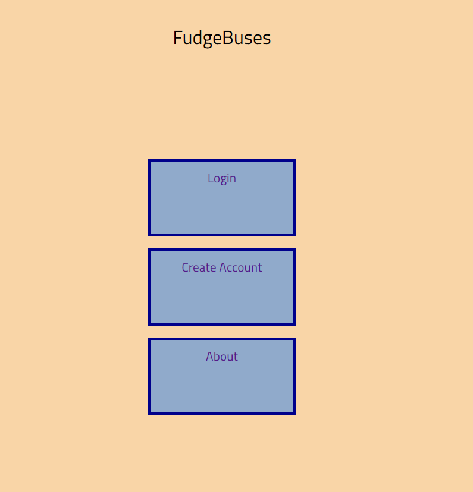
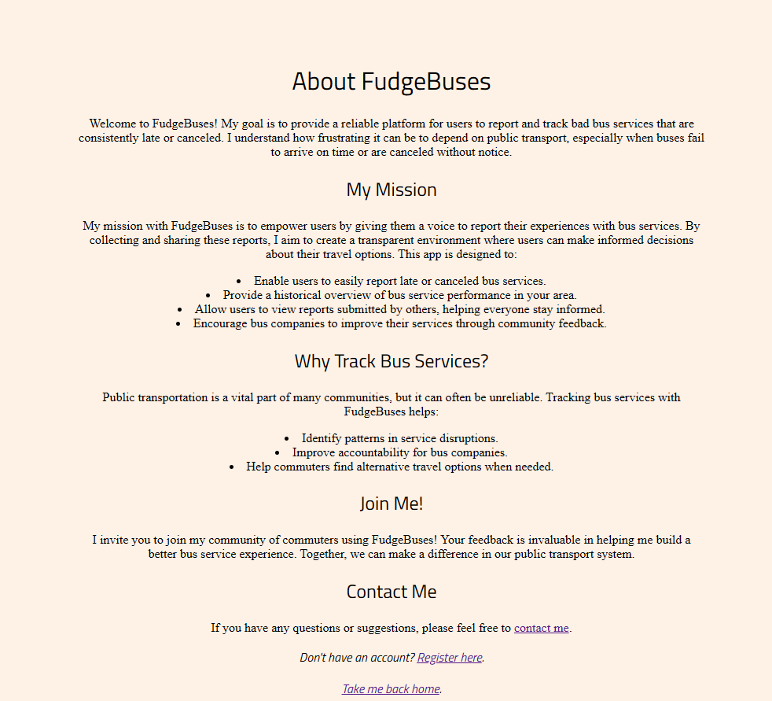
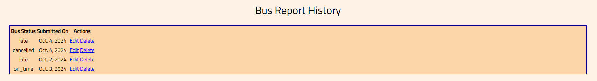

# FudgeBuses

Welcome to FudgeBuses! This web application aims to provide a reliable platform for users to report and track bad bus services that are consistently late or canceled. Understanding the frustrations of relying on public transport, FudgeBuses empowers users to share their experiences and helps create a transparent environment for making informed travel decisions.

**My Mission**  
The mission of FudgeBuses is to give users a voice in reporting their experiences with bus services. The app enables users to easily report late or canceled services, providing a historical overview of bus service performance in their area. Users can will be able to view the collective data submitted by others, helping everyone stay informed about local bus services. Additionally, FudgeBuses hopes that this will put pressure and encourage bus companies to improve their services.

**Why Track Bus Services?**  
Public transportation is a vital part of many communities but can often be unreliable. By tracking bus services with FudgeBuses, users can identify patterns in service disruptions, improve accountability for bus companies, and find alternative travel options when needed. This platform aims to make public transportation more reliable and user-friendly for everyone.

[FudgeBuses on Heroku](https://fudgebuses-2818f2a44822.herokuapp.com/)
  
[FudgeBuses on Github](https://github.com/chuckydillo/fudge-buses)

## User Experience Design 

### User Stories

- **As a user, I can create an account so that I can report buses and keep track of my regular bus routes.**
  - AC1: Account creation page is available.
  - AC2: Data required for account creation includes:
    - Forename
    - Surname
    - Age
    - Email
    - Password
  - AC3: Review and confirm data before submitting.

- **As a user, I can login to my account.**
  - AC1: A way to login to the account is provided.

- **As a user, I can have a dedicated homepage with a quick view of personalized information.**
  - AC1: When accessing the site after being logged in, the user's homepage displays relevant information about their bus routes.

- **As a user, I can fill in a form to report buses.**
  - AC1: The form should include the following information:
    - Bus Company
    - Bus Number
    - Route (more than 1 route per bus number)
    - Location
    - Time
    - Status:
      - On time
      - Late
      - Cancelled (If reported cancelled on official sources)
      - No show (Status not reported in official sources)
  - AC2: Page to confirm information is correct before submission.
  - AC3: Submit confirmation page.

- **As a user, I can edit and delete my prior reports so that I can fix mistakes.**
  - AC1: Ability for the user to edit records.
  - AC2: Ability for the user to delete records.

- **As a user, I can logout.**
  - AC1: A way to logout of the account is provided.

## Features 

### Existing Features

- **Landing Page**  
  The landing page is designed with a simplified user experience in mind, offering an uncluttered interface for quick registration or login. The strategic approach aims to attract users through advertising and organic word-of-mouth referrals.

  

- **About Page**  
  The About Page provides an insightful overview of FudgeBuses, detailing its mission and vision. It serves to educate users about the platform's purpose and the value it brings to the community.

  

- **Navigation Bar**  
  The navigation bar is thoughtfully integrated into the user interface, providing logged-in users with effortless access to essential features. For administrators, a distinct navigation bar appears, tailored to facilitate efficient site management and oversight.

  

- **Report Form**  
  The Report Form allows users to easily select bus routes and stops, enabling them to report the status of their journeys—whether a bus is late, canceled, or on time. This feature empowers users to contribute to the community's knowledge of service reliability.

  

- **Report History**  
  The Report History section offers users a comprehensive view of their past submissions, allowing them to edit or delete reports as necessary. This feature fosters transparency and encourages users to keep their contributions current and relevant.

  

### Features Left to Implement

- **APIs for Data Management**  
  Integration of APIs to import and update all bus route information and data, ensuring users have access to the latest service details.

- **Heat Maps**  
  Implementation of heat maps to visually represent the quality of bus services, highlighting areas with good and bad service performance for easy user reference.

- **Account Management**  
  Robust account management features that empower users to control their settings, preferences, and personal information with ease.

- **Mobile Notifications**  
  Notifications for mobile devices to prompt users to submit reports on their bus services, enhancing community engagement and data collection.

- **User Interface Improvements**  
  Continuous enhancements to the user interface and overall design of the application, aimed at providing a more intuitive and enjoyable user experience.

- **Performance Analytics**  
  Users can generate graphs and tables to analyze the performance of their bus routes over specified time periods, offering insights into service reliability and trends.

## Agile

For FudgeBuses, I used Agile planning to stay organized throughout the project. GitHub Projects was a helpful tool where I could create tasks, boards, and milestones.

[FudgeBuses project Board](https://github.com/users/chuckydillo/projects/8/views/1)

### MoSCoW Prioritization
I followed the MoSCoW Prioritization method to decide what features were most important for FudgeBuses which i applied to labels in the user stories:

- **Must Haves**: These were the essential features that had to be completed first. Finishing the "must haves" allowed me to create a basic, working version of the app (MVP).
- **Should Haves**: These features were important but not critical at first. They could wait until after the "must haves" were done.
- **Could Haves**: Nice-to-have features, which would be great if time allowed after the higher priority work was finished.
- **Won't Haves**: These were features that didn’t fit the project right now or were low priority for this version.

Using this method helped keep me focused on what mattered most during development.

## Testing 

### 1. Reporting a Bus
- **Functionality**: Users should be able to report a bus along with various statuses.
- **Verification**: 
    - Checked that users can select different statuses, such as:
        - Delayed
        - Canceled
        - On Time
    - Confirmed that the report is submitted successfully and stored in the system.

### 2. Editing Reports
- **Functionality**: Users should have the ability to edit their prior bus reports.
- **Verification**: 
    - Verified that users can access their previous reports.
    - Checked that users can modify details of their reports and save the changes.

### 3. Authentication and Access Control
- **Functionality**: Only authenticated users should have access to specific pages.
- **Verification**: 
    - Ensured that unauthenticated users are redirected to the login page when attempting to access protected routes.
    - Confirmed that only the appropriate authenticated users can add, edit, and delete records.

### 4. User Registration
- **Functionality**: Users should be able to register for an account.
- **Verification**: 
    - Checked that the registration form is accessible and all necessary fields are present.
    - Confirmed that users receive a confirmation message upon successful registration.

### 5. User Login
- **Functionality**: Users should be able to log into their accounts.
- **Verification**: 
    - Verified that users can access the login page.
    - Checked that users can successfully log in with valid credentials and are redirected to the appropriate landing page.

### 6. User Logout
- **Functionality**: Users should be able to log out of their accounts.
- **Verification**: 
    - Checked that users can log out by clicking the logout button.
    - Confirmed that users are redirected to the homepage after logging out and that their session is terminated.

### Validator Testing 

- HTML
  - Errors on several pages were detected and fixed after passing it through the valdiator. [W3C validator](https://validator.w3.org/nu/?doc=https%3A%2F%2Fcode-institute-org.github.io%2Flove-running-2.0%2Findex.html)
- CSS
  - No errors were found when passing through the official [(Jigsaw) validator](https://jigsaw.w3.org/css-validator/validator?uri=https%3A%2F%2Fvalidator.w3.org%2Fnu%2F%3Fdoc%3Dhttps%253A%252F%252Fcode-institute-org.github.io%252Flove-running-2.0%252Findex.html&profile=css3svg&usermedium=all&warning=1&vextwarning=&lang=en#css)

## Deployment

For deployment on Heroku, I used the Code Institute produced guide. A copy of which can be found [here](https://docs.google.com/document/d/14SR7GJW1zH6vre7Dlh-OLrjpVHWbs84w119smExxso0/edit?usp=sharing). 

## Credits

I would like to acknowledge the following resources and tools that contributed significantly to the development of **FudgeBuses**:

- **Django Documentation**  
  For detailed guidance and comprehensive explanations on the core components of Django, including views, models, and URL routing:  
  [Django Documentation](https://docs.djangoproject.com/en/5.1/)

- **Satyarepala's Medium Article**  
  A comprehensive guide to understanding and working with Django views:  
  [Understanding Django Views](https://medium.com/@satyarepala/a-comprehensive-guide-to-django-views-understanding-types-and-use-cases-4a02a078ced)

- **W3Schools Django Guide**  
  For clear and concise tutorials on Django:  
  [W3Schools Django Tutorial](https://www.w3schools.com/django/index.php)

- **Figma**  
  For creating wireframes and designing the layout of the application:  
  [Figma](https://www.figma.com/)

- **drawSQL**  
  Used for generating the Entity-Relationship Diagram (ERD) for the database schema:  
  [drawSQL](https://drawsql.app/)

- **ChatGPT**  
  For assistance with debugging, checking code for PEP 8 standards, and generating content for the `about.html` page:  
  [ChatGPT](https://openai.com/chatgpt)

- **PerplexityAI**  
  For providing explanations and breaking down complex code blocks to enhance my understanding:  
  [PerplexityAI](https://www.perplexity.ai/)

- **StackEdit**  
Used for editing and formatting the markdown in the README and documentation:  
[StackEdit](https://stackedit.io/)

- **Prior Student Projects**  
  Used for looking at examples of how prior projects were done in the past, and their scope:  
  [Kieran's CI Capstone Project](https://github.com/doctypeKieran/ci-capstone-project)  
  [Rachbry's Django Cookbook](https://github.com/rachbry/recipme-django-cookbook)  
  [Hibo Ibrahim's The Book Booth](https://github.com/hiboibrahim/thebookbooth1)